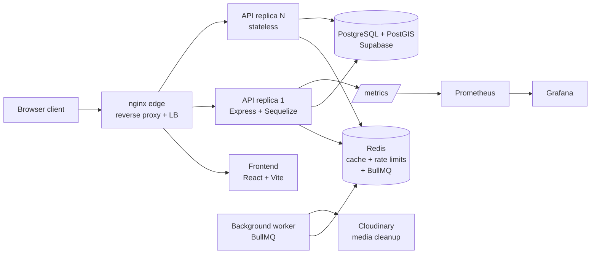

# CrimeLens

[](https://github.com/abubakar-ahmed-dev/Crime-Lens/actions/workflows/ci.yml)
[](https://github.com/abubakar-ahmed-dev/Crime-Lens/actions/workflows/docker-build.yml)
[](https://github.com/abubakar-ahmed-dev/Crime-Lens/actions/workflows/release.yml)
[](LICENSE)

CrimeLens is a crime mapping, reporting, verification, and analytics platform.
Citizens report incidents, police verify and manage them, and the public
explores approved data through maps and statistics — backed by a
production-style architecture: a stateless containerized API behind an nginx
edge, Redis caching and rate limiting, background workers, and full
observability.

| Crime Map | Statistics |
|---|---|
|  |  |

## Features

- **Public** — interactive crime map (Leaflet + marker clustering), radius
  search, zone overlays with severity, statistics dashboards
- **Citizens** — registration (email + Google OAuth via Supabase Auth),
  profile completion, crime reporting with manual/device/map location and
  media evidence, report-status tracking
- **Police** — verification queue, approve/reject, record editing with
  zone-boundary validation, media management (visibility/caption/evidence)
- **Admin** — agent verification, branch management, direct agent creation,
  CSV bulk import, job-queue visibility
- **Cross-cutting** — JWT (staff) + Supabase Auth (citizens) dual
  authentication, role-based access, request validation, structured logging,
  metrics, distributed rate limiting

## Architecture



- **Stateless API** — any replica can serve any request; shared state lives in
  Redis/Postgres
- **Redis cache-aside** — stats/reference reads served from cache (measured
  100% hit ratio under sustained load, 5-min TTL, explicit invalidation)
- **Redis-backed rate limiting** — per-IP tiers: AUTH 5/min (5-min lockout),
  WRITE 10/min, SENSITIVE 3/h, PUBLIC 50/min, shared across all replicas
- **BullMQ worker** — Cloudinary media cleanup out of the request lifecycle,
  retries + idempotency
- **Observability** — Prometheus metrics (request rate/latency histograms,
  pool state, cache hit rate, queue depth), Grafana dashboards, pino
  structured logs, `/health` + `/ready`

## System-design upgrades (16 phases)

Measured — not aspirational. Full evidence in [`Plans/`](Plans/SYSTEM-DESIGN-IMPLEMENTATION.md).

| # | Phase | Delivers |
|---|---|---|
| 0 | k6 baseline infrastructure | Reusable load-test lib + suites (executed 2026-08-26) |
| 1 | PostgreSQL/Sequelize optimization | Pagination, env-driven pool (max 10), query work |
| 2 | Health checks | `/health` (liveness) + `/ready` (DB/Redis dependency checks) |
| 3 | Redis caching | Cache-aside for stats/reference; ~15 ms cached reads vs 100s of ms DB round trips |
| 4 | Rate limiting | Redis-backed tiers + lockouts, verified live (429 at exactly N+1 per tier) |
| 5 | API security | Helmet, schema validation, strict CORS, request limits |
| 6 | HTTP compression | gzip for API responses |
| 7 | Pino logging | Structured logs with request IDs |
| 8 | Prometheus + Grafana | Request/latency/pool/cache/queue metrics + dashboards |
| 9 | Docker | Compose stack: edge, API, worker, Redis, monitoring |
| 10 | Nginx edge | Reverse proxy + load balancing, upstream timing logs, metrics hardening |
| 11 | Horizontal scaling | 1/2/3-instance verification; shared-host finding documented |
| 12 | BullMQ workers | Async Cloudinary cleanup with retries; admin queue endpoints |
| 13 | Cloudflare/TLS/CDN | **Deferred** — needs a domain |
| 14 | CI/CD | GitHub Actions: lint, build, smoke boot vs real Postgres/Redis, CodeQL, audits, GHCR image publishing, releases |
| 15 | Frontend lint cleanup | 83 → 0 ESLint errors; CI lint enforcing |
| 16 | Final scalability testing | Controlled before/after rerun of the phase-0 suite — results below |

## Performance (measured)

Controlled like-for-like rerun of the unmodified Phase 0 k6 suite against the
upgraded stack, same machine and workload
([full report](Plans/phase-16-k6-final/results/baseline-comparison/comparison-report.md)):

| Run (identical workload) | Before (2026-08-26) | After | Δ |
|---|---|---|---|
| Baseline 16 min, 115 VUs — throughput | 25.5 req/s | **55.4 req/s** | **2.2×** |
| Baseline — p95 latency | 5,130 ms | **655 ms** | **−87%** |
| Stress 17 min, 500 VUs — throughput | 32.3 req/s | **282 req/s** | **8.7×** |
| Stress — p95 latency | 36,640 ms | **2,800 ms** | **−92%** |
| Spike (50→500→50 VUs) | queued everything | **10.2× requests absorbed**, recovery p50 18→19 ms | resilient |
| `/api/stats/summary` p50 (cache) | 4,804 ms | **15 ms** | **−99.7%** |
| HTTP errors (baseline) | 0.10% | **0.006%** | fewer |

Known ceiling: the Postgres connection pool is the binding resource — cached
routes hold ~15 ms at every load level while DB-bound map reads saturate the
pool first. Analysis and next levers in the
[final report](Plans/phase-16-k6-final/results/final-scalability-report.md).

## Quickstart (Docker)

Prerequisites: Docker Desktop, a Supabase project (Postgres + PostGIS + Auth)
and a Cloudinary account for media.

```bash
# 1. Configure
cp db-project-backend/.env-sample db-project-backend/.env   # fill in values
# (frontend VITE_* vars are public-by-design and baked at build time)

# 2. Build and start the full stack
docker compose up -d --build

# 3. Verify
curl http://localhost/api/health   # {"status":"healthy",...}
```

Committed defaults: app on :80, API on :5001, Prometheus :9090, Grafana
:3000. (Local development on this repo adds a gitignored
`docker-compose.override.yml` that remaps ports — edge :18000, replicas
:15001-15003, Prometheus :19090, Grafana :13300; see
[docs/SETUP.md](docs/SETUP.md).)

## Manual development

```bash
cd db-project-backend && npm ci && npm start     # API on :5001
cd db-project-frontend && npm ci && npm run dev  # Vite dev server
```

Full setup (Supabase schema/PostGIS, auth providers, Cloudinary, env
variables): [`docs/SETUP.md`](docs/SETUP.md).

## Testing

```bash
cd db-project-backend
node --check server.js                                   # syntax
k6 run tests/k6/smoke-test.js                            # endpoint smoke
k6 run tests/k6/runs/baseline.js                         # load suite
```

CI runs on every PR: frontend lint (enforcing) + build (tsc), backend syntax
check, a live smoke boot against real Postgres/Redis service containers
(health/ready/metrics + worker SIGTERM), CodeQL, and npm audit at
critical-only threshold. Docker builds + Trivy scans publish to GHCR on
`dev`/`main`/tags. See [`.github/workflows/`](.github/workflows/).

## Project structure

```
├── docker-compose.yml           # full stack: edge, API, worker, redis, prometheus, grafana
├── Dockerfile.backend           # API + worker image
├── Dockerfile.frontend          # nginx-served SPA image
├── db-project-backend/          # Express + Sequelize API (see its README)
│   ├── config/                  # db, redis, queue, rate limiter, prometheus, logger
│   ├── controllers/ routes/     # domain logic + routing
│   ├── middleware/              # auth, rate limit, validation
│   └── tests/k6/                # load-test suites + shared lib
├── db-project-frontend/         # React + TypeScript + Vite SPA (see its README)
├── docs/                        # setup, architecture, API, operations, observability
├── infra/                       # prometheus + grafana provisioning
├── scripts/                     # ops helpers (scaling, pool analysis, cleanup)
└── Plans/                       # 16-phase engineering record: plans, logs, measured results
```

## Documentation

| Doc | Contents |
|---|---|
| [docs/SETUP.md](docs/SETUP.md) | Environment setup (Docker + manual), all env variables |
| [docs/ARCHITECTURE.md](docs/ARCHITECTURE.md) | System design, caching/rate-limit/queue design, scaling findings |
| [docs/API.md](docs/API.md) | Endpoint reference (auth + rate limits) |
| [docs/DATABASE.md](docs/DATABASE.md) | Schema, PostGIS, connection-pool budget |
| [docs/OBSERVABILITY.md](docs/OBSERVABILITY.md) | Metrics, dashboards, logs, health checks |
| [docs/OPERATIONS.md](docs/OPERATIONS.md) | Runbook: scaling, pool analysis, cache/queue ops, failure drills |
| [docs/DEPLOYMENT.md](docs/DEPLOYMENT.md) | Images, deploy path, what is deferred |
| [docs/PERFORMANCE.md](docs/PERFORMANCE.md) | Methodology + measured results summary |
| [docs/KNOWN_ISSUES.md](docs/KNOWN_ISSUES.md) | Known limits + deferred work |

## License

[MIT](LICENSE) © 2025-2026 abubakar-ahmed-dev
