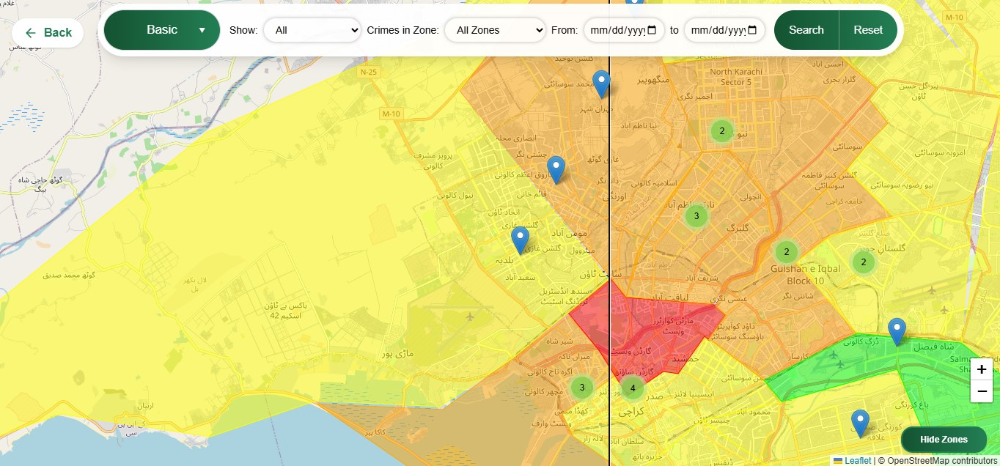
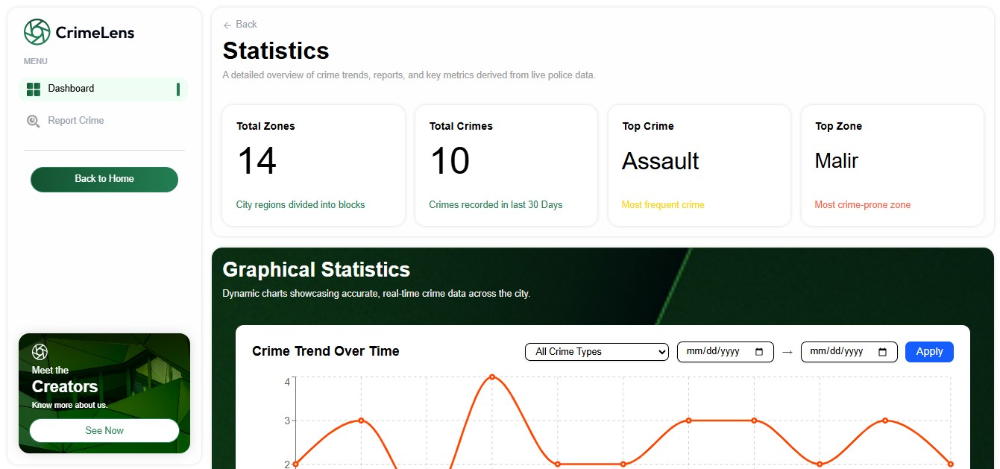
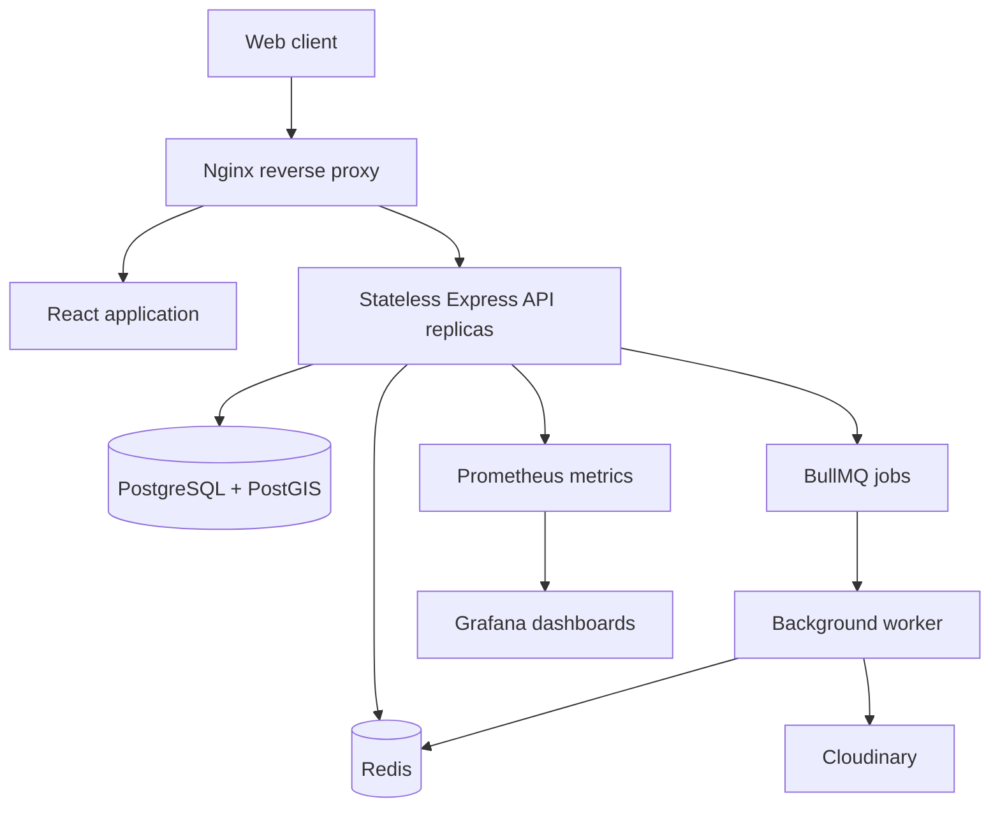

# CrimeLens

[](https://github.com/abubakar-ahmed-dev/Crime-Lens/actions/workflows/ci.yml)
[](https://github.com/abubakar-ahmed-dev/Crime-Lens/actions/workflows/docker-build.yml)
[](https://github.com/abubakar-ahmed-dev/Crime-Lens/actions/workflows/release.yml)
[](LICENSE)

CrimeLens is a full-stack crime reporting, verification, mapping, and analytics platform. It connects citizens, police personnel, administrators, and the public through role-specific workflows while maintaining one verified source of crime data.

Citizens can submit incident reports with location and media evidence. Police personnel review and manage reports, administrators oversee users and operational data, and approved incidents become available through interactive maps, geospatial searches, and statistical dashboards.

The platform is built as a modular PERN application with PostGIS-based geospatial processing, Redis-backed caching and rate limiting, background job processing, containerized services, and application observability.

| Crime map | Statistics |
| --- | --- |
|  |  |

## Core Capabilities

### Public crime intelligence

- Explore approved incidents on an interactive Leaflet map.
- Group dense map data through marker clustering.
- Search for incidents within a selected radius.
- View crime zones, severity information, trends, and statistical summaries.
- Access public crime data without exposing restricted report or user information.

### Citizen reporting

- Register with email and password or Google through Supabase Auth.
- Complete and maintain a citizen profile.
- Submit crime reports with incident details, location, and supporting media.
- Select a location manually, from the device, or directly from the map.
- Track the verification status of submitted reports.

### Police operations

- Review submitted incidents through a verification queue.
- Approve or reject reports according to verification outcomes.
- Edit crime records while enforcing zone-boundary validation.
- Review and manage uploaded evidence, visibility, and captions.
- Access operational data according to assigned role and branch permissions.

### Administration

- Verify and manage police personnel.
- Create staff accounts and maintain branch information.
- Import structured records in bulk through CSV files.
- Monitor background processing jobs and operational state.
- Manage platform data through role-protected administrative workflows.

## How CrimeLens Works

1. A citizen records an incident and provides its location and any available evidence.
2. CrimeLens validates the request and stores the report for authorized review.
3. Police personnel examine the submission and approve or reject it.
4. Approved records become part of the public geospatial and statistical dataset.
5. Cache invalidation keeps public maps and dashboards consistent with verified data.

Only approved incidents are included in public crime intelligence. Administrative details, private media, and protected user data remain behind authenticated and role-authorized endpoints.

## Technology Stack

| Area | Technologies |
| --- | --- |
| Frontend | React, TypeScript, Vite, Redux Toolkit, TanStack Query, Tailwind CSS, shadcn/ui |
| Mapping | Leaflet, marker clustering, GeoJSON |
| Backend | Node.js, Express, Sequelize |
| Database | PostgreSQL, PostGIS, Supabase |
| Authentication | Supabase Auth, Google OAuth, JWT, role-based access control |
| Cache and queues | Redis, BullMQ |
| Media | Cloudinary |
| Edge and containers | Nginx, Docker, Docker Compose |
| Observability | Prometheus, Grafana, Pino |
| Testing and delivery | k6, ESLint, TypeScript, GitHub Actions, CodeQL, Trivy |

## System Architecture



The application is organized as a modular monolith: domain logic remains within one backend codebase, while runtime responsibilities are separated across the API, worker, database, cache, frontend, edge, and monitoring services.

### Stateless API layer

API instances do not depend on process-local session state. Shared application state is stored in PostgreSQL or Redis, allowing Nginx to distribute requests across multiple replicas.

### Geospatial data model

PostgreSQL with PostGIS stores incident coordinates and crime-zone geometry. Spatial queries support radius searches, zone assignment, boundary validation, and location-based analysis.

### Cache-aside reads

Frequently requested statistics and reference data are served through Redis using a cache-aside strategy. Mutating operations explicitly invalidate affected keys so public results do not remain stale until the time-to-live expires.

### Shared rate limiting

Rate-limit counters are stored in Redis rather than individual API processes. Limits therefore remain consistent when the backend is running with multiple replicas.

| Request class | Limit |
| --- | --- |
| Authentication | 5 requests per minute with a 5-minute lockout |
| Write operations | 10 requests per minute |
| Sensitive operations | 3 requests per hour |
| Public reads | 50 requests per minute |

### Background processing

BullMQ moves Cloudinary cleanup work out of the request lifecycle. Jobs support retry behavior and idempotent processing, while authorized administrators can inspect queue state.

### Observability

- Pino produces structured application logs with request identifiers.
- Prometheus collects request rate, latency, connection-pool, cache, and queue metrics.
- Grafana provides dashboards for runtime and performance monitoring.
- Liveness and readiness endpoints separate process health from dependency availability.

## Authentication and Security

CrimeLens uses separate authentication flows for its two main identity groups:

- Citizens authenticate through Supabase Auth using email/password or Google OAuth.
- Police and administrative users authenticate through the staff JWT flow.

Authorization is enforced through role-based middleware so each user can access only the routes and records required by their responsibilities. Additional API protections include request-schema validation, Helmet security headers, strict CORS configuration, payload-size limits, and Redis-backed rate limiting.

Environment secrets are supplied at runtime and must not be committed to source control.

## Performance and Scalability

CrimeLens has been evaluated with reusable k6 suites covering ordinary traffic, gradually increasing load, sudden spikes, authentication, report submission, statistics, and geospatial endpoints.

The following results were recorded on the tested containerized stack using the documented workload and environment:

| Scenario | Workload | Result |
| --- | --- | --- |
| Sustained load | 16 minutes, up to 115 virtual users | 55.4 requests/second; 655 ms p95 latency |
| Stress test | 17 minutes, up to 500 virtual users | 282 requests/second; 2.8 s p95 latency |
| Traffic spike | 50 → 500 → 50 virtual users | Stable recovery; p50 returned from 18 ms to 19 ms |
| Cached statistics | `/api/stats/summary` | 15 ms p50 latency |
| Sustained-load reliability | Baseline workload | 0.006% HTTP error rate |

Cached routes remained responsive under load, while database-bound map queries reached the PostgreSQL connection-pool limit first. This identifies database concurrency and geospatial query cost as the primary scaling boundary for the tested environment.

Detailed methodology and raw comparisons are available in [`docs/PERFORMANCE.md`](docs/PERFORMANCE.md).

> Benchmark results describe the documented test environment and workload; they are not a production service-level guarantee.

## Getting Started

### Prerequisites

- Docker Desktop with Docker Compose
- A Supabase project with PostgreSQL, PostGIS, and Auth configured
- A Cloudinary account for report media
- Git

### Run with Docker

1. Clone the repository:

   ```bash
   git clone https://github.com/abubakar-ahmed-dev/Crime-Lens.git
   cd Crime-Lens
   ```

2. Create the backend environment file:

   ```bash
   cp db-project-backend/.env-sample db-project-backend/.env
   ```

3. Add the required Supabase, database, authentication, Redis, and Cloudinary values. Frontend variables prefixed with `VITE_` are included at build time and must also be configured before building the frontend image.

4. Build and start the application:

   ```bash
   docker compose up -d --build
   ```

5. Check the API health endpoint:

   ```bash
   curl http://localhost/api/health
   ```

The default Compose configuration exposes the application through Nginx on port `80`, the API on `5001`, Prometheus on `9090`, and Grafana on `3000`.

For database schema, authentication-provider, environment-variable, and local port configuration, see [`docs/SETUP.md`](docs/SETUP.md).

### Manual development

Start the backend:

```bash
cd db-project-backend
npm ci
npm start
```

Start the frontend in another terminal:

```bash
cd db-project-frontend
npm ci
npm run dev
```

Manual development requires accessible PostgreSQL and Redis services plus correctly configured backend and frontend environment files.

## API and Service Endpoints

| Endpoint | Purpose |
| --- | --- |
| `/api/health` | Liveness check for the API process |
| `/api/ready` | Readiness check for required dependencies |
| `/metrics` | Prometheus-format application metrics |
| `/api/crimes` | Approved crime records and map data |
| `/api/stats/*` | Crime statistics and analytical summaries |

The platform also provides authenticated route groups for citizen reports, police verification, administrative management, media operations, branches, and background jobs. Request formats, authentication requirements, pagination, and rate-limit classes are documented in [`docs/API.md`](docs/API.md).

## Testing

### Static checks and frontend build

```bash
cd db-project-frontend
npm ci
npm run lint
npm run build
```

### Backend syntax check

```bash
cd db-project-backend
node --check server.js
```

### k6 smoke and load tests

```bash
cd db-project-backend
k6 run tests/k6/smoke-test.js
k6 run tests/k6/runs/baseline.js
```

Load tests require a running application, suitable test data, and dedicated test credentials. Do not run stress or spike suites against an environment that is not intended for performance testing.

## Continuous Integration and Delivery

GitHub Actions validates changes and automates container delivery:

- Frontend linting and TypeScript build validation
- Backend syntax validation
- Application smoke startup with PostgreSQL and Redis service containers
- Health, readiness, metrics, and worker-shutdown checks
- CodeQL analysis and critical-level dependency auditing
- Docker image builds and Trivy vulnerability scanning
- GHCR image publishing for configured branches and tags
- Release workflow automation

Workflow definitions are available in [`.github/workflows`](.github/workflows/).

## Project Structure

```text
.
├── .github/workflows/          # CI, security, image, and release workflows
├── db-project-backend/         # Express and Sequelize application
│   ├── config/                 # Database, Redis, queue, metrics, and logging
│   ├── controllers/            # Request and domain orchestration
│   ├── middleware/             # Authentication, authorization, validation, limits
│   ├── routes/                 # Public and protected API routes
│   └── tests/k6/               # Smoke, load, stress, and spike tests
├── db-project-frontend/        # React and TypeScript client
├── docs/                       # Setup, architecture, API, and operations guides
├── infra/                      # Prometheus and Grafana configuration
├── scripts/                    # Operational and analysis utilities
├── Dockerfile.backend          # Backend and worker image
├── Dockerfile.frontend         # Nginx-served frontend image
└── docker-compose.yml          # Complete local service stack
```

## Documentation

| Document | Description |
| --- | --- |
| [`docs/SETUP.md`](docs/SETUP.md) | Environment variables, Supabase setup, Docker, and manual development |
| [`docs/ARCHITECTURE.md`](docs/ARCHITECTURE.md) | Runtime architecture and design decisions |
| [`docs/API.md`](docs/API.md) | Endpoint contracts, authentication, pagination, and rate limits |
| [`docs/DATABASE.md`](docs/DATABASE.md) | PostgreSQL schema, PostGIS usage, and connection-pool configuration |
| [`docs/OBSERVABILITY.md`](docs/OBSERVABILITY.md) | Metrics, dashboards, logs, health, and readiness checks |
| [`docs/OPERATIONS.md`](docs/OPERATIONS.md) | Scaling, cache, queue, pool analysis, and failure-response procedures |
| [`docs/PERFORMANCE.md`](docs/PERFORMANCE.md) | Load-test methodology and measured results |

## Contributing

Contributions and issue reports are welcome. For substantial changes, open an issue first to discuss the problem, proposed behavior, and any effect on the API or database schema. Keep pull requests focused and include relevant tests or verification steps.

## License

CrimeLens is available under the [MIT License](LICENSE).

© 2025–2026 [abubakar-ahmed-dev](https://github.com/abubakar-ahmed-dev)
