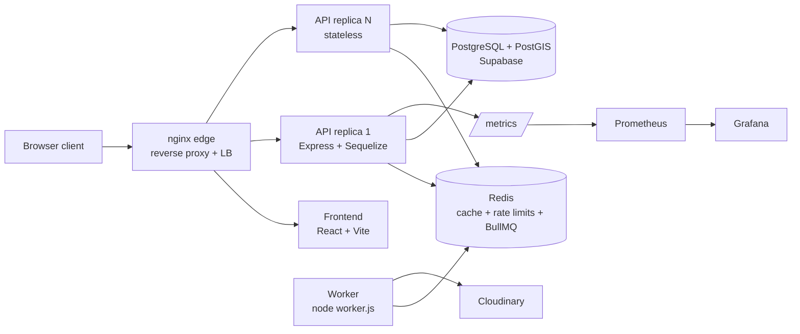

# Architecture

CrimeLens is a full-stack web application for public crime visibility, citizen crime reporting, and police/admin record management.

## High-Level System

CrimeLens runs as a containerized modular monolith behind an nginx edge.



Runtime pieces (docker-compose.yml):

- **nginx edge** — single entry point; serves the frontend SPA, proxies
  `/api` to the API replicas (`least_conn`), strips `/metrics`, logs
  upstream timings. OSS nginx resolves the upstream at startup, so the
  edge is restarted after replica-count changes.
- **API replicas** — stateless Express instances; any replica can serve any
  request. No sessions, no local files, no in-process rate limits.
- **Redis** — shared infrastructure for three concerns: cache-aside caching,
  distributed rate limiting, and BullMQ queues. `noeviction` (queue jobs
  must not be evicted; cache/limiter keys all carry TTLs).
- **Worker** — same image as the API, `node worker.js`; processes Cloudinary
  media-cleanup jobs outside the request lifecycle.
- **Supabase PostgreSQL + PostGIS** — remote database; connection budget:
  instances × pool max (10) must stay under the measured `max_connections`
  (60).
- **Prometheus/Grafana** — scrape `/metrics` (per-instance targets);
  dashboards provisioned from `infra/`.

## Frontend

Location:

```text
db-project-frontend/
```

Main technologies:

- React
- TypeScript
- Vite
- Redux Toolkit for role state
- React Router
- Supabase client
- Leaflet / React Leaflet for maps
- Recharts for statistics
- Tailwind utility classes
- Lucide icons

Important files:

- `src/App.tsx` - route composition and route guards.
- `src/routes/index.tsx` - public, citizen-protected, and staff-protected route lists.
- `src/layouts/page-layouts.tsx` - shared layout, sidebar, mobile menu behavior.
- `src/context/AuthContext.tsx` - staff and citizen auth flows.
- `src/config/constants.js` - API base URL.
- `src/store/features/current_role.tsx` - current role state and localStorage synchronization.

## Backend

Location:

```text
db-project-backend/
```

Main technologies:

- Express
- Sequelize
- PostgreSQL/Supabase
- PostGIS
- Supabase Auth SDK
- JWT
- bcrypt/bcryptjs
- multer
- fast-csv

Important files:

- `server.js` - Express startup and route mounting.
- `models/index.js` - Sequelize initialization and model associations.
- `middleware/authMiddleware.js` - JWT/staff auth and Supabase citizen auth.
- `config/envValidation.js` - required environment validation.
- `config/supabase.js` - Supabase client setup.
- `config/multerConfig.js` - CSV upload file filter and size limit.

## Backend Route Modules

- `authRoutes.js` - staff login.
- `citizenAuthRoutes.js` - citizen registration, login, profile, report tracking.
- `userRoutes.js` - citizen report submission and police report verification.
- `crimeRoutes.js` - public map crimes, crime types, police crime records.
- `agentRoutes.js` - agent requests, approval, records.
- `adminRoutes.js` - CSV upload, branch controls, direct police agent creation.
- `statsRoutes.js` - public statistics.
- `zoneRoutes.js` - public zones, severity, boundary checks.

## Main Workflows

### Public Map And Statistics

1. User opens `/map` or `/statistics`.
2. Frontend calls public API routes.
3. Backend queries approved crimes only for map/statistics.
4. Results are rendered without requiring auth.

### Citizen Registration And Reporting

1. Citizen registers through Supabase Auth via backend citizen route.
2. Backend creates `CrimeReportsSubmitter`.
3. Citizen verifies email when required by Supabase.
4. Citizen completes profile with CNIC/contact/address.
5. Citizen submits report through `POST /api/user/report-crime`.
6. Backend creates `Crime` with `pending` status.
7. Backend creates `CrimeSubmission` linking the citizen submitter to the crime.

### Police Verification

1. Police logs in through staff login.
2. Police opens verification page.
3. Frontend calls `GET /api/user/pending`.
4. Police approves or rejects a pending submission.
5. On approval, backend validates location against selected zone boundary.
6. Backend sets crime status to `approved` and stores `latestUpdatedBy`.
7. On rejection, backend sets crime status to `rejected`.

### Police Crime Record Management

1. Police opens crime records.
2. Frontend calls police-only crime endpoints.
3. Police can update approved crime details.
4. Location updates are validated against the selected zone boundary.
5. Delete performs a soft delete by setting status to `deleted`.

### Admin Agent And Branch Management

1. Admin logs in through staff login.
2. Admin can review agent requests and approve/reject them.
3. Admin can create branches.
4. Admin can directly create police agents.
5. Admin can assign or clear branch heads.

### CSV Import

1. Admin uploads a CSV file.
2. Backend parses and validates rows.
3. Backend deduplicates against existing crimes and within the CSV.
4. Backend inserts valid non-duplicate rows.
5. Backend writes an `UploadLog`.

## Data Access Pattern

The backend uses a mixture of:

- Sequelize model methods.
- Raw SQL through `sequelize.query`.

Raw SQL is common in controllers where joins, PostGIS functions, or custom views are needed.

## Frontend State Pattern

Auth and role state are split:

- `AuthContext` manages actual login/session data.
- Redux `current_role` controls role-dependent UI state.
- localStorage persists role/auth mode across refreshes.

## Caching Design

Cache-aside on stats/reference reads (`services/cacheService.js`):

```text
lookup -> HIT: return cached
       -> MISS: query DB, store in Redis (TTL 5 min), return
```

- Key registry in `config/redis.js`, all under the `crimelens:` namespace
  (`crimelens:stats:*`, `crimelens:reference:*`), so invalidation can be
  pattern-scoped (`PATTERN_STATS` invalidates on writes).
- Every cacheable response carries `X-Cache: HIT|MISS`.
- If Redis is unavailable the API degrades to direct DB queries (fail-open),
  guarded by connection-readiness checks to avoid reconnect queues.

## Rate-Limiting Design

`config/rateLimiter.js` + `middleware/rateLimiterMiddleware.js` —
rate-limiter-flexible over Redis, keys namespaced `crimelens:rl:*`,
per-IP, shared across replicas. Tiers: AUTH 5/min (+5-min lockout),
WRITE 10/min, SENSITIVE 3/h, PUBLIC 50/min (one shared bucket across all
public read routes — burst on one route consumes the same bucket).
An in-memory insurance limiter plus a 1 s consume timeout keeps the API
responsive when Redis is down.

## Background Jobs

BullMQ (`config/queue.js`, `worker.js`): the API enqueues Cloudinary
media-cleanup batches after a crime delete commits; the worker processes
them with 3 attempts / exponential backoff. Queue depth is exposed as a
Prometheus gauge; admin endpoints `GET /api/jobs/queues` and
`GET /api/jobs/status/:jobId` expose operational visibility.

## Scaling Findings (measured)

Phase-16 comparison runs
([report](../Plans/phase-16-k6-final/results/baseline-comparison/comparison-report.md)):

- Single host, mixed profile: open-model ceiling ~100–110 req/s; cached
  routes hold ~15 ms p50 at every load level.
- The Postgres connection pool (10) is the binding constraint, not Node/CPU:
  DB-bound map reads saturate it first (`state="waiting"` grows while CPU
  stays under 40%).
- Replicas on one host split the same CPU/DB contention (phase 11); real
  scale-out needs separate hosts, and pool budgets must be re-balanced
  (instances × 10 ≤ 60).
